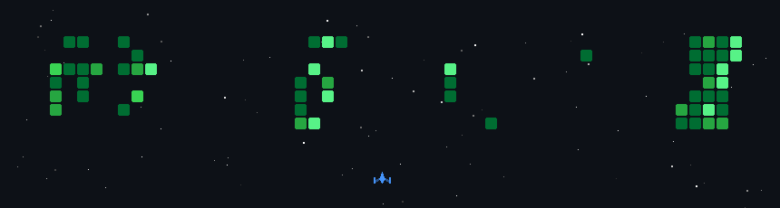

<h1> 👋🏼Hi, I'm Ali Gaffar Toksoy</h1>

Computer Engineering Student | Cloud & DevOps Enthusiast | AI & Data Science Background

Computer Engineering student passionate about Cloud, DevOps, and AI-driven systems.
I enjoy building scalable solutions and intelligent applications by combining my background in Artificial Intelligence and Data Science.
I have gained experience through programs and internships with Huawei and Microsoft, while also working as a Red Bull Student Marketeer.
Additionally, I achieved 1st place in Turkey in a national-level competition, reflecting my motivation to create impactful and innovative technologies.

    

<table>

<!-- Programming Languages -->
<tr>
<td width="80%">

### 💻 Programming Languages

</td>
<td width="40%">

</td>
</tr>

<!-- AI / ML -->
<tr>
<td width="80%">

### 🤖 AI / Machine Learning

</td>
<td width="40%">

</td>
</tr>

<!-- Cloud & DevOps -->
<tr>
<td width="80%">

### ☁️ Cloud & DevOps

</td>
<td width="40%">

</td>
</tr>

<!-- Databases -->
<tr>
<td width="80%">

### 🗄 Databases

</td>
<td width="40%">

</td>
</tr>

<!-- Backend Frameworks -->
<tr>
<td width="80%">

### 🛠️ Backend Frameworks & Development Environments

</td>
<td width="40%">

</td>
</tr>

<!-- Tools & Platforms -->
<tr>
<td width="80%">

### 🧰 Tools & Platforms

</td>
<td width="40%">

</td>
</tr>

</table>

    

    

    

## 📊 GitHub Statistics

  
  

  
  
  

